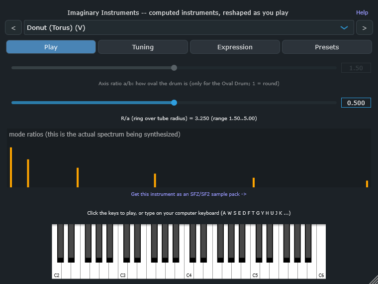
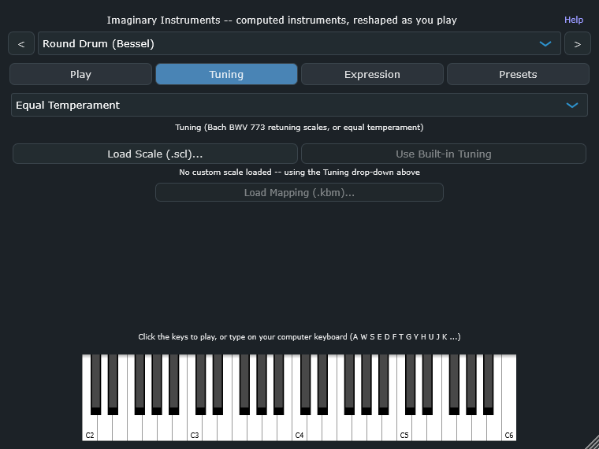
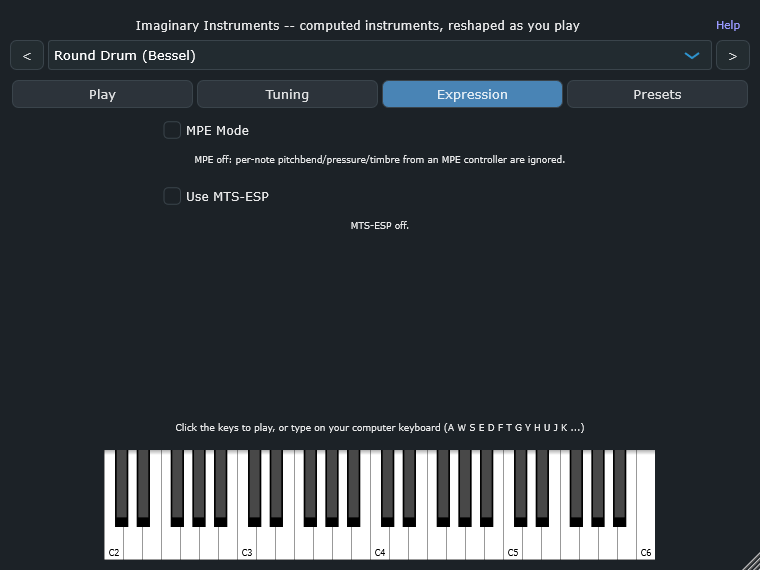
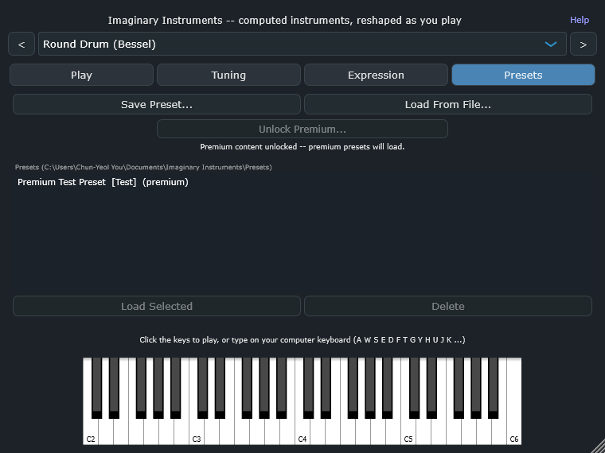

# Imaginary Instruments — user guide

Imaginary Instruments is a free VST3 plugin (Windows/Linux) where every sound is **computed from
physics**, not recorded or sampled. 41 instruments: 14 are shapes with no real-world equivalent at all
(a donut, two overlapping spheres, a 4D/5D hyperball...), and the other 27 are physically-grounded
builds (metal plates, bars, strings, tapped air columns) using the same engine.

## Install

- **Windows**: run the installer (`ImaginaryInstruments-Setup-*.exe`). Installs for the current user,
  no administrator prompt.
- **Linux**: copy `Imaginary Instruments.vst3` to `~/.vst3/` and rescan plugins in your DAW.
- The Windows build isn't code-signed, so Windows SmartScreen may warn on first run — that's expected
  for an unsigned indie release, not a sign anything's wrong.

## The top bar (always visible)

- **Instrument picker** — the dropdown lists all 41 instruments, grouped by family. Entries marked
  **(V)** are the purely imaginary shapes with no real-world equivalent.
- **`<` / `>` buttons** — step to the previous/next instrument in the full list.
- **Help** (top right) — opens this page in your browser.

## The four tabs

### Play

- **Axis ratio slider** — only does anything for the Oval Drum (1 = round, up to an axis ratio of 2).
- **Shape knob** — morphs the geometry live for the Egg, Donut, Twin Drums, Cone and Two Spheres. Greyed
  out for instruments it doesn't apply to.
- **Mode-ratio chart** — this is the actual overtone spectrum being synthesized right now, not a
  decoration; it updates live as you change instrument/shape/axis ratio.
- **SFZ/SF2 link** — under the chart, a link to the sample-pack version of whichever instrument is
  currently selected (see "Sample packs" below).

### Tuning

- Choose equal temperament or one of three experimental scales derived from Bach's Invention No. 2, or
- Load a Scala **`.scl`** scale (and optionally a **`.kbm`** keyboard mapping) to override it with your
  own tuning entirely.

### Expression

- **MPE** — lets a compatible controller bend/pressure each held note independently.
- **MTS-ESP** — follow a tuning broadcast live from an MTS-ESP master plugin elsewhere in your DAW,
  instead of the Tuning tab's own choice.

### Presets

- **Save Preset... / Load From File...** — write/read a `.vipreset` file anywhere on disk.
- The list below is a browser: every `.vipreset` found under
  `Documents/Imaginary Instruments/Presets` (searched recursively — a premium pack is just a folder of
  `.vipreset` files dropped in there). Double-click, or select and **Load Selected**.
- Premium presets (marked "(premium)") need an unlock code entered via **Unlock Premium...** before they
  can be loaded.

## The keyboard

Click the on-screen keys, or type on your computer keyboard (A = middle C). Every instrument here is
percussive: notes decay by themselves, and releasing a key does not stop the sound.

## Sample packs (SFZ/SF2)

Every instrument in the plugin is also available as a royalty-free SFZ/SF2 sample pack, organised by
family — click the link under the mode-ratio chart for whichever instrument you're on, or go straight
to:

- First 10 imaginary instruments: [full set](https://mirryouser.gumroad.com/l/eyojwr) · [free taster (Round Drum)](https://mirryouser.gumroad.com/l/ywlxpw)
- 4 Hyperball instruments: [full set](https://mirryouser.gumroad.com/l/xqkpfk) · [free taster (4D)](https://mirryouser.gumroad.com/l/cshmye)
- 8 metal instruments: [full set](https://mirryouser.gumroad.com/l/hqxlll) · [free taster (Bell)](https://mirryouser.gumroad.com/l/yyjtwt)
- 6 bars: [full set](https://mirryouser.gumroad.com/l/dwjian) · [free taster (Marimba)](https://mirryouser.gumroad.com/l/mnpxtk)
- 5 strings: [full set](https://mirryouser.gumroad.com/l/neyvvzo) · [free taster (Piano-like String)](https://mirryouser.gumroad.com/l/fsnjbf)
- 8 air columns: [full set](https://mirryouser.gumroad.com/l/wvmrdm) · [free taster (Cup-and-Flare Bore)](https://mirryouser.gumroad.com/l/rsvaxh)

## Also available: the free Android app

The same computed-instrument engine (Free Play set) is also available as **Golden Ear: Sound Explorer**
(formerly "Instrument Explorer"), a free Android app with an ear-training quiz mode built around it. See
the [Android app guide](android-guide.html).

## Honest note on realism

The metal, bar, string and tube instruments are computed with solvers checked against exact solutions
or mesh refinement, but none has been compared with a published measurement of a real object. Among the
first 10 (drum-like) instruments, every one is a bounded resonator with a fixed boundary: the Round
Drum matches a real timpani measurement to five significant figures; the rest are new colours inspired
by a shape, not simulations of real drums or bells.

## Support

Bug reports, questions, anything else: **mirryou@gmail.com**
