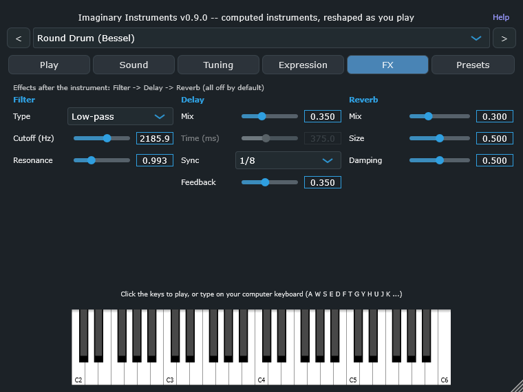

# Imaginary Instruments — user guide

Imaginary Instruments is a free VST3 and CLAP plugin (Windows/Linux; also LV2 on Linux) where every sound is **computed from
physics**, not recorded or sampled. 41 instruments: 12 are shapes with no real-world instrument equivalent at all
(a donut, two overlapping spheres, a 4D/5D hyperball...), and the other 29 are physically-grounded
builds (metal plates, bars, strings, tapped air columns) using the same engine.

## Install

- **Windows**: run the installer (`ImaginaryInstruments-Setup-*.exe`). Installs for the current user,
  no administrator prompt.
- **Linux**: copy `Imaginary Instruments.vst3` to `~/.vst3/` (and `Imaginary Instruments.clap` to `~/.clap/`, or the `Imaginary Instruments.lv2` folder to `~/.lv2/` for LV2 hosts such as Ardour) and
  rescan plugins in your DAW.
- **CLAP** (0.9 and later): the plugin also comes as a CLAP plug-in for hosts such as Bitwig Studio and REAPER. The
  Windows installer puts it in the standard CLAP folder; it has the same sound and controls as the VST3, and its settings are saved with your project.
- The Windows build isn't code-signed, so Windows SmartScreen may warn on first run — that's expected
  for an unsigned indie release, not a sign anything's wrong.

## The top bar (always visible)

- **Instrument picker** — the dropdown lists all 41 instruments, grouped by family. Entries marked
  **(V)** are the purely imaginary shapes with no real-world equivalent.
- **`<` / `>` buttons** — step to the previous/next instrument in the full list.
- **Help** (top right) — a menu: this guide, and the update check (see "Updates" below).

## The six tabs

### Play

- **Axis ratio slider** — only does anything for the Oval Drum (1 = round, up to an axis ratio of 2).
- **Shape knob** — morphs the geometry live for the Egg, Donut, Twin Drums, Cone and Two Spheres. Greyed
  out for instruments it doesn't apply to.
- **Mode-ratio chart** — this is the actual overtone spectrum being synthesized right now, not a
  decoration; it updates live as you change instrument/shape/axis ratio and the strike position.
- **SFZ/SF2 link** — under the chart, a link to the sample-pack version of whichever instrument is
  currently selected (see "Sample packs" below).

### Sound (new in 0.9)

These shape the sound on top of the computed physics. Each takes effect from the next note you play.
- **Velocity -> Brightness** — how much softer notes lose their upper partials, roughly what happens when
  a soft mallet or finger stays in contact longer. 0 = every velocity has the same spectrum. Loudness
  still follows velocity either way.
- **Decay** — multiplies how long every partial rings (1 = the computed decay times).
- **Material** — makes higher partials die away faster than lower ones. 0 = as computed; around 1
  sounds more like wood.
- **Stretch** — spreads the overtones apart (positive) or squeezes them together (negative): each
  partial's frequency ratio r to the fundamental becomes r^(1 + stretch). The fundamental does not move.
  0 = the computed spacing.
- **Partials** — how many of the lowest modes sound (1 to 63, or All). Fewer modes give a simpler, purer tone.
- **Stereo width** (free) — spreads the partials across the stereo field; the fundamental stays in the centre.
  0 = mono, exactly as in earlier versions. Summed to mono, the level stays the same.
- **Detune** (premium) — splits each partial into a pair a few cents apart (0 to 20 cents), so it beats,
  like the split mode pairs of a real bell. It is an effect laid on top of the physics. Detune doubles the number
  of partials, so it roughly doubles the plugin's CPU use while it is on (measured: 16 low piano notes at 48 kHz,
  13 % of one core without Detune, 26 % with it, on an Intel i7-11700K); with Detune at 0 nothing changes. Without an unlock
  code the slider is greyed out and marked "(premium)"; its value is kept but has no effect.
- **Strike position / Excitation point** — where the instrument is struck (or, for the hollow shapes, where
  the sound is excited). A partial whose vibration has a node at that point goes quiet: strike a string in
  the middle and its even harmonics vanish; strike the Round Drum or a round plate at its centre and only its
  ring-shaped modes sound. The amplitudes come from each instrument's own computed mode shapes. It works for
  every instrument except the bowed string (whose model has no bow position):
  - strings: 0 = right at the end, 1 = the middle; bars: 0 = the end, 1 = the centre (kalimba: clamp to tip)
  - drums and plates: from the centre (or the ring's inner edge) out towards the edge, along a line shown
    in the note under the slider (the Oval Drum and Elliptic Plate along the long axis, the Star Plate
    towards an arm tip)
  - Bell and Bowl: along the outside of the body -- the Bell from the lip up to the crown, the Bowl from
    the rim down to the bottom
  - hollow shapes and hyperballs (the label changes to **Excitation point**): from the centre out towards
    the wall; the path is chosen so that no whole family of modes is always silent
  - air columns (also **Excitation point** -- the model is the air inside, not the tube wall): along the
    bore from the closed end (or one open end) to the mouth; in the middle of the Open Pipe the even modes vanish
  Turn **Natural** off to move it; with Natural on, each instrument keeps its original sound (plucked strings
  at 1/5 of the length, the piano's hammer rule, bars at 0.4 of their length, the kalimba at its tip, and the
  original fixed overtone mix for the other instruments).
Projects and presets saved with an older version open with these controls at their neutral settings,
so they sound as before. One exception: in 0.9.0 a calculation error in the open-end correction of the air
columns was fixed, so the Cone Pipe, Exponential Horn, Cup-and-Flare Bore and Flared Pipe have slightly
different overtones (by up to 31 cents; the Cone Pipe by less than 0.1 cent).

### Tuning

- Choose equal temperament or one of three experimental scales derived from Bach's Invention No. 2, or
- Load a Scala **`.scl`** scale (and optionally a **`.kbm`** keyboard mapping), or an AnaMark **`.tun`** file (a
  pitch for every MIDI note, as used by u-he, Vital and others), to override it with your own tuning entirely.
- **Reference A4 (Hz)** — concert pitch, 380 to 480 Hz (440 = standard; double-click to reset, or type
  a value such as 415 or 432). The whole tuning moves with it. It applies to the drop-down tunings and to
  a `.scl` on the default mapping; a loaded `.kbm` or `.tun`, an MTS-ESP master and MIDI Tuning messages set their own absolute pitch, and
  the tab says so when that is the case.

### Expression

- **MPE** — lets a compatible controller bend/pressure each held note independently.
- **MTS-ESP** — follow a tuning broadcast live from an MTS-ESP master plugin elsewhere in your DAW,
  instead of the Tuning tab's own choice.
- **Retune ringing notes when the MTS-ESP tuning changes** — on: notes that are still sounding glide
  to the new pitch when the tuning changes (MTS-ESP or MIDI Tuning messages). Off: each note keeps the pitch it started with.
- **Accept MIDI Tuning Standard (sysex) messages** -- tuning messages from the MIDI specification, sent by some
  DAWs, hardware and tuning tools, retune the plugin when no MTS-ESP master is running (a loaded `.scl`/`.tun`
  still takes priority). The received tuning is not saved with the project; the sender normally re-sends it.

### FX (premium, new in 0.9)

Effects after the instrument, in the order Filter -> Delay -> Reverb. All are off by default, and when all
are off the sound is exactly as before. Controls of an effect that is off are greyed out until you turn it on
(choose a filter **Type**, or raise the Delay or Reverb **Mix** above 0); the Delay **Time** is greyed out while
**Sync** is used.
- **Filter** — **Type** (Off, low-pass, high-pass or band-pass), **Cutoff** and **Resonance**.
- **Delay** — **Mix** (0 = off), **Time** in milliseconds, or **Sync** to a note value at the host tempo,
  and **Feedback** (limited to 0.85, so it never runs away).
- **Reverb** — **Mix** (0 = off), **Size** and **Damping**.

Without a license key the tab is greyed out with a note; saved values are kept and come back when you
unlock (see "Premium unlock" below).

### Presets

- **Save Preset... / Load From File...** — write/read a `.vipreset` file anywhere on disk.
- The list below is a browser: every `.vipreset` found under
  `Documents/Imaginary Instruments/Presets` (searched recursively — a premium pack is just a folder of
  `.vipreset` files dropped in there). Double-click, or select and **Load Selected**.
- Premium presets (marked "(premium)") need a license key entered via **Unlock Premium...** before they
  can be loaded.

### Premium unlock
The premium unlock (premium presets, Detune and the FX tab) comes with a **license key** from Gumroad: it is
in your purchase receipt e-mail and in your Gumroad library. In the Presets tab click **Unlock Premium...**,
paste the key and click **Unlock**.
- The key is checked **once** with Gumroad over the internet. After that the plugin remembers it on this
  computer and never needs the internet again.
- Only the key itself is sent, to Gumroad's license service. Nothing else is sent: no account, no computer
  ID, no usage data. The only other connection is the update check (see "Updates" below).
- A key can be activated on up to 10 computers or reinstalls. If you run out, contact support.
- No internet on this computer? Contact support for an offline unlock code (it starts with `VIP1-`), which
  you enter in the same box.

### Updates
The **Help** menu (top right) has **User guide**, **Check for updates now** and **Check for updates
automatically (once a day)**, which is on by default. The check only reads a small public file on the
project website that says which version is current; nothing is sent. When a newer version exists, an
**Update available** link appears next to Help. Nothing is downloaded or installed by itself: the link
opens the download page. Turn the automatic check off in the same menu if you prefer.

## The keyboard

Click the on-screen keys, or type on your computer keyboard (A = middle C). Every instrument here is
percussive: notes decay by themselves, and releasing a key does not stop the sound.

## Standalone app: audio output (0.9 and later)

The standalone app (outside a DAW) remembers the audio output you choose in its settings. If that output
disappears for a while, for example a monitor's HDMI audio while the screen sleeps, the app plays through
another device in the meantime and switches back to your chosen output as soon as it returns.

## Sample packs (SFZ/SF2)

Every instrument in the plugin is also available as a royalty-free SFZ/SF2 sample pack, organised by
family — click the link under the mode-ratio chart for whichever instrument you're on, or go straight
to:

- First 10 imaginary instruments: [full set](https://mirryouser.gumroad.com/l/eyojwr) · [free taster (Round Drum)](https://mirryouser.gumroad.com/l/ywlxpw)
- 4 Hyperball instruments: [full set](https://mirryouser.gumroad.com/l/xqkpfk) · [free taster (4D)](https://mirryouser.gumroad.com/l/cshmye)
- 8 metal instruments: [full set](https://mirryouser.gumroad.com/l/hqxlll) · [free taster (Bell)](https://mirryouser.gumroad.com/l/yyjtwt)
- 6 bars: [full set](https://mirryouser.gumroad.com/l/dwjian) · [free taster (Marimba)](https://mirryouser.gumroad.com/l/mnpxtk)
- 5 strings: [full set](https://mirryouser.gumroad.com/l/neyvvzo) · [free taster (Piano-like String)](https://mirryouser.gumroad.com/l/fsnjbf)
- 8 air columns: [full set](https://mirryouser.gumroad.com/l/wvmrdm) · [free taster (Cup-and-Flare Bore)](https://mirryouser.gumroad.com/l/rsvaxh)

## Also available: the free Android app

The same computed-instrument engine (Free Play set) is also available as **Golden Ear: Sound Explorer**
(formerly "Instrument Explorer"), a free Android app with an ear-training quiz mode built around it. See
the [Android app guide](android-guide.html).

## Honest note on realism

The metal, bar, string and tube instruments are computed with solvers checked against exact solutions
or mesh refinement, but none has been compared with a published measurement of a real object. Among the
first 10 (drum-like) instruments, every one is a bounded resonator with a fixed boundary: the Round
Drum reproduces the exact ideal round-membrane solution to five significant figures; the rest are new colours inspired
by a shape, not simulations of real drums or bells.

## Support

Bug reports, questions, anything else: **mirryou@gmail.com**
